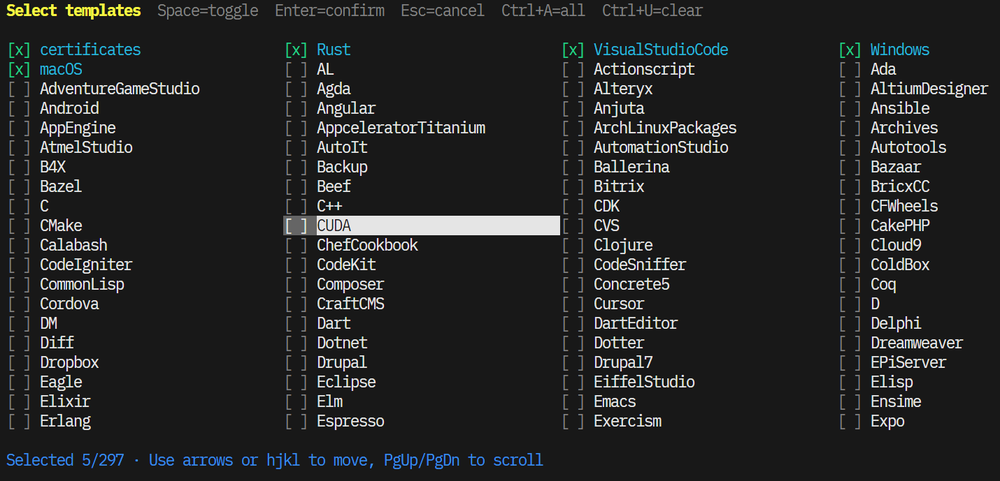

<p align="center">
  
</p>
<br/>
<p align="center">
  <!-- <a href="https://github.com/kmizuki/lightignore/releases"></a> -->
  <!-- <a href="https://github.com/kmizuki/lightignore/actions/workflows/release.yml"></a> -->
  <a href="https://www.rust-lang.org"></a>
  <a href="https://github.com/kmizuki/lightignore/blob/main/LICENSE"></a>
</p>
<br/>

# Lightignore

Lightning-fast, interactive .gitignore generator

<p align="left">
  
</p>

## Features

- 📦 Automatically fetches official gitignore templates from GitHub
- 💾 Caches templates locally for offline use
- 🔧 Support for custom templates
- ⚡ Fast and lightweight

## Installation

### Using curl (Recommended)

```bash
curl -LsSf https://github.com/kmizuki/lightignore/releases/download/latest/lightignore-installer.sh | sh
```

### From source

```bash
git clone https://github.com/kmizuki/lightignore
cd lightignore
cargo install --path .
```

## Usage

### Generate .gitignore file

```bash
lignore generate
# or simply
lignore
```

### Specify output file

```bash
lignore generate -o .gitignore
```

### List available templates

```bash
lignore list
```

### Update template cache

```bash
lignore update
```

### Update lightignore itself

```bash
lignore self-update
```

## Keyboard Shortcuts

- `Space` - Toggle template selection
- `Enter` - Confirm selection
- `Esc`/`q` - Cancel
- `↑↓←→` or `hjkl` - Navigate
- `PgUp`/`PgDn` - Scroll page
- `Home`/`End` - Jump to start/end
- `Ctrl+A` - Select all
- `Ctrl+U` - Clear all

## Custom Templates

You can define custom templates in `lignore.json`:

```json
{
  "templates": ["Rust", "Node"],
  "custom": {
    "MyProject": ["# My custom patterns", "*.local", ".env", "secrets/"]
  }
}
```

## Contributing

Contributions are welcome! Please feel free to submit a Pull Request.
